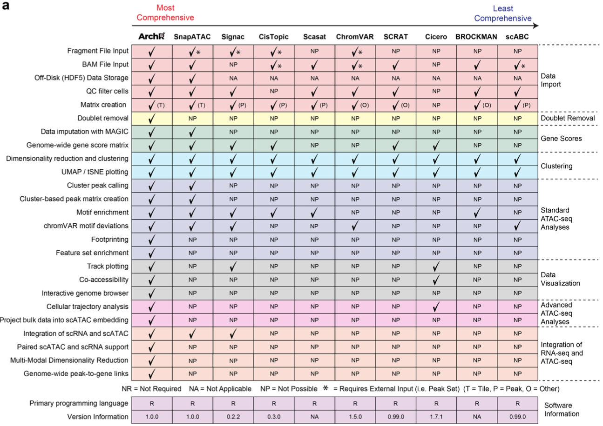

# scATAC-seq data analysis tools and papers

 

Single-cell ATAC-seq related tools and genomics data analysis resources. Tools are sorted by publication date, reviews and most recent publications on top. Unpublished tools are listed at the end of each section. Please, [contribute and get in touch](CONTRIBUTING.md)! See [MDmisc notes](https://github.com/mdozmorov/MDmisc_notes) for other programming and genomics-related notes. See [scRNA-seq_notes](https://github.com/mdozmorov/scRNA-seq_notes) for scRNA-seq related resources.

# Table of content

<!-- START doctoc generated TOC please keep comment here to allow auto update -->

<!-- DON'T EDIT THIS SECTION, INSTEAD RE-RUN doctoc TO UPDATE -->

- [Preprocessing pipelines](#preprocessing-pipelines)
  - [Imputation](#imputation)
- [Integration, Multi-omics methods](#integration-multi-omics-methods)
- [Clustering, visualization](#clustering-visualization)
- [Technology](#technology)
- [Data](#data)
  - [Human](#human)
  - [Mouse](#mouse)
- [Miscellaneous](#miscellaneous)

<!-- END doctoc generated TOC please keep comment here to allow auto update -->

- Review of chromatin accessibility profiling methods (wet-lab, technologies, downstream analysis and tools, applications), both bulk and single cell. DNAse-seq, ATAC-seq, MNase-seq, many more. Multi-omics technologies, integratie approaches. 

    
Paper

    Minnoye, Liesbeth, Georgi K. Marinov, Thomas Krausgruber, Lixia Pan, Alexandre P. Marand, Stefano Secchia, William J. Greenleaf, et al. “Chromatin Accessibility Profiling Methods.” Nature Reviews Methods Primers, (December 2021), https://doi.org/10.1038/s43586-020-00008-9. Supplementary Table 1 - Commonly used bioinformatics tools for data processing and analysis of bulk and single-cell chromatin accessibility data, https://static-content.springer.com/esm/art%3A10.1038%2Fs43586-020-00008-9/MediaObjects/43586_2020_8_MOESM1_ESM.pdf

- Single-cell multiomics technologies, integration of transriptome with genome, epigenome, and proteome. Table 1 - summary of technologies. Cell isolation and barcoding. Figure 2 - genome-transcriptome single-cell technologies, Figure 3 - epigenome-transcriptome technologies, Figure 4 - proteome-transcriptome technologies. Figure 5 - overview of computational methods (dimensionality reduction, clustering, network, pseudotime inference, CNV detection), references to reviews. Integrative analysis methods (LIGER, MOFA). 

    
Paper

    Lee, Jeongwoo, Do Young Hyeon, and Daehee Hwang. “Single-Cell Multiomics: Technologies and Data Analysis Methods.” Experimental & Molecular Medicine, September 15, 2020. https://doi.org/10.1038/s12276-020-0420-2.

## Preprocessing pipelines

- scATAC-seq analysis guidelines. Technologies, data preprocessing, peak annotation, QC, matrix building, batch correction, dimensionality reduction, visualization, clustering, cell identity annotation, chromatin accessibility dynamics, motif analysis. Table 1 - summary of 13 pipelines. Tools, methods, databases.
    - Baek, Seungbyn, and Insuk Lee. “[Single-Cell ATAC Sequencing Analysis: From Data Preprocessing to Hypothesis Generation](https://doi.org/10.1016/j.csbj.2020.06.012).” Computational and Structural Biotechnology Journal, (2020)

- [Benchmarking of 10 scATAC-seq analysis methods](https://github.com/pinellolab/scATAC-benchmarking/) (brief description of each in Methods) on 10 synthetic (various depth and noise levels) and 3 real datasets. scATAC technology overview, problems. Three clustering methods (K-means, Louvain, hierarchical clustering), adjusted Rand index, adjusted mutual information, homogeneity for benchmarking against gold-standard clustering, Residual Average Gini Index for benchmarking against gene markers (silver standard). SnapATAC, Cusanovich2018, cisTopic perform best overall. [R code, Jupyter notebooks](https://github.com/pinellolab/scATAC-benchmarking/)
    - Chen, Huidong, Caleb Lareau, Tommaso Andreani, Michael E. Vinyard, Sara P. Garcia, Kendell Clement, Miguel A. Andrade-Navarro, Jason D. Buenrostro, and Luca Pinello. “[Assessment of Computational Methods for the Analysis of Single-Cell ATAC-Seq Data](https://doi.org/10.1186/s13059-019-1854-5).” Genome Biology 20, no. 1 (December 2019)

[Extended Data Fig. 1: Comparison of supported features from currently available scATAC-seq software.](https://www.nature.com/articles/s41588-021-00790-6/figures/5), from ArchR paper.

- [ArchR](https://www.archrproject.com/) - R package for processing and analyzing single-cell ATAC-seq data. Compared to Signac and SnapATAC, has more functionality, faster, handles large (>1M cells) data. Input - BAM files. Efficient HDF5-based storage allows for large dataset processing. Quality control, doublet detection (similar performance to Scrublet), genome-wide 500bp binning and peak identification, assignment to genes using best performing model, dimensionality reduction (optimized Latent Semantic Indexing, multiple iterations of LSI), clustering, overlap enrichment with a compendium of previously published ATAC-seq datasets, trajectory analysis (Slingshot and Monocle 3), integration with scRNA-seq data (Seurat functionality). [Code to reproduce the paper](https://github.com/GreenleafLab/ArchR_2020), [GitHub](https://github.com/GreenleafLab/ArchR). [Tweet 1](https://twitter.com/JeffreyGranja/status/1364996903029547012?s=20), [Tweet 2](https://twitter.com/doctorcorces/status/1364995515121721346?s=20), [Tweet 3](https://twitter.com/WJGreenleaf/status/1365005818706370564?s=20)
    - Granja, Jeffrey M., M. Ryan Corces, Sarah E. Pierce, S. Tansu Bagdatli, Hani Choudhry, Howard Y. Chang, and William J. Greenleaf. “[ArchR Is a Scalable Software Package for Integrative Single-Cell Chromatin Accessibility Analysis](https://doi.org/10.1038/s41588-021-00790-6).” Nature Genetics, February 25, 2021 

- [SnapATAC](https://github.com/r3fang/SnapATAC) - scATAC-seq pipeline for processing, clustering, and motif identification. Snap file format  Genome is binned into equal-size (5kb) windows, binarized with 1/0 for ATAC reads present/absent, Jaccard similarity between cells, normalized to account for sequencing depth (observed over expected method, two others), PCA on the matrix KNN graph and Louvain clustering to detect communities, tSNE or UMAP for visualization. Motif analysis and GREAT functional enrichment for each cluster. Nystrom algorithm to reduce dimensionality, ensemble approach. Outperforms ChromVAR, LSA, Cicero, Cis-Topic. Very fast, can be applied to ChIP-seq, scHi-C. [SnapTools to work with snap files](https://github.com/r3fang/SnapTools)
    - Fang, Rongxin, Sebastian Preissl, Yang Li, Xiaomeng Hou, Jacinta Lucero, Xinxin Wang, Amir Motamedi, et al. “[Comprehensive Analysis of Single Cell ATAC-Seq Data with SnapATAC](https://doi.org/10.1038/s41467-021-21583-9).” Nature Communications 12, no. 1 (February 1, 2021)

- [scATAC-pro](https://github.com/tanlabcode/scATAC-pro) - pipeline for scATAC-seq mapping, QC, peak detection, clustering, TF and GO enrichment analysis, visualization (via VisCello). Compared with Scasat, Cellranger-atac. 
    - Yu, Wenbao, Yasin Uzun, Qin Zhu, Changya Chen, and Kai Tan. “[ScATAC-pro: A Comprehensive Workbench for Single-Cell Chromatin Accessibility Sequencing Data](https://doi.org/10.1186/s13059-020-02008-0).” Genome Biology 21, no. 1 (December 2020)

- [scOpen](https://github.com/CostaLab/scopen) - estimating open chromatin status in scATAC-seq experiments, aka imputation/smoothing of extreme sparse matrices. Uses positive-unlabelled learning of matrices to estimate the probability that a region is open in a given cell. The probability matrix can be used as input for downstream analyses (clustering, visualization). Integrated with the footprint transcription factor activity score (scHINT). scOpen estimated matrices tested as input for scABC, chromVAR, cisTopic, Cicero, improve performance
    - Li, Zhijian, Christoph Kuppe, Mingbo Cheng, Sylvia Menzel, Martin Zenke, Rafael Kramann, and Ivan G Costa. “[ScOpen: Chromatin-Accessibility Estimation of Single-Cell ATAC Data](https://doi.org/10.1101/865931).” Preprint. Bioinformatics, December 5, 2019

- [scABC](https://github.com/SUwonglab/scABC), single-cell Accessibility Based Clustering - scATAC-seq clustering. Weights cells by a nonlinear transformation of library sizes, then, weighted K-medoids clustering. Input - single-cell mapped reads, and the full set of called peaks. Applied to experimental and synthetic scATAC-seq data, outperforms simple K-means-based clustering, SC3
    - Zamanighomi, Mahdi, Zhixiang Lin, Timothy Daley, Xi Chen, Zhana Duren, Alicia Schep, William J. Greenleaf, and Wing Hung Wong. “[Unsupervised Clustering and Epigenetic Classification of Single Cells](https://doi.org/10.1038/s41467-018-04629-3).” Nature Communications 9, no. 1 (December 2018)

- [Cicero](https://cole-trapnell-lab.github.io/cicero-release/) - connect distal regulatory elements with target genes (covariance-based, graphical Lasso to compute a regularized covariance matrix) along pseudotime-ordered (Monocle2 or 3) scATAC-seq data. Optionally, adjusts for batch covariates. Applied to the analysis of skeletal myoblast differentiation, sciATAC-seq. [R package](https://cole-trapnell-lab.github.io/cicero-release/)
    - Pliner, Hannah A., Jonathan S. Packer, José L. McFaline-Figueroa, Darren A. Cusanovich, Riza M. Daza, Delasa Aghamirzaie, Sanjay Srivatsan, et al. “[Cicero Predicts Cis-Regulatory DNA Interactions from Single-Cell Chromatin Accessibility Data](https://doi.org/10.1016/j.molcel.2018.06.044).” Molecular Cell 71, no. 5 (September 2018)

- [ChromVAR](https://github.com/GreenleafLab/chromVAR) - scATAC-seq analysis. Identifying peaks, get a matrix of counts across aggregated peaks, tSNE for clustering, identifying motifs. Integrated with Seurat.
    - Schep, Alicia N, Beijing Wu, Jason D Buenrostro, and William J Greenleaf. “[ChromVAR: Inferring Transcription-Factor-Associated Accessibility from Single-Cell Epigenomic Data](https://doi.org/10.1038/nmeth.4401).” Nature Methods 14, no. 10 (August 21, 2017)

- [scATAC-pro](https://github.com/wbaopaul/scATAC-pro) - A comprehensive tool for processing, analyzing and visulizing single cell chromatin accessibility sequencing data. 

## Clustering, visualization

- [Dimensionality Reduction for scATAC-seq Data](http://andrewjohnhill.com/images/posts/2019-5-6-dimensionality-reduction-for-scatac-data/analysis.html)

- [ShinyArchR.UiO](https://github.com/EskelandLab/ShinyArchRUiO) - R Shiny app for scATAC-seq data analysis and visualization using [ArchR](https://www.archrproject.com/). UMAP, clustering, integration with scRNA-seq, functional enrichment analysis. Runs locally. [Demo server with a hematopoietic tutorial dataset](https://cancell.medisin.uio.no/ShinyArchR.UiO/). 

    
Paper

    Sharma, Ankush, Akshay Akshay, Marie Rogne, and Ragnhild Eskeland. “ShinyArchR.UiO: User-Friendly,Integrative and Open-Source Tool for Visualization of Single-Cell ATAC-Seq Data Using ArchR.” Edited by Can Alkan. Bioinformatics 38, no. 3 (January 12, 2022): 834–36. https://doi.org/10.1093/bioinformatics/btab680.

- [ChromSCape](https://bioconductor.org/packages/ChromSCape/) - Shiny/R application for single-cell epigenomic data visualization. clustering, differential peak analysis (Wilcoxon, edgeR), linking peaks to genes, pathway enrichment (hypergeometric on MSigDb). Wraps scater, scran, corrects for batch effect using fastMNN from batchelor, determines the optimal number of clusters with ConsensusClusterPlus (2-10 clusters). Input - BAM, BED files, or count matrix. Compared with Cusanovich2018, SnapATAC, CisTopic, EpiScanpy. Multiple datasets. [Web demo](https://vallotlab.shinyapps.io/ChromSCape/), [GitHub](https://github.com/vallotlab/ChromSCape), [Code for the paper](https://github.com/vallotlab/ChromSCape_benchmarking)
    - Prompsy, Pacôme, Pia Kirchmeier, Justine Marsolier, Marc Deloger, Nicolas Servant, and Céline Vallot. “[Interactive Analysis of Single-Cell Epigenomic Landscapes with ChromSCape](https://doi.org/10.1038/s41467-020-19542-x).” Nature Communications, (December 2020)

- [cisTopic](https://github.com/aertslab/cistopic) - R/Bioconductor package for probabilistic modelling of cis-regulatory topics from scATAC-seq. Topic modelling for identification of cell types, enhancers, transcription regulators. Binarizing chromatin accessibility matrix, Latent Dirichlet Allocation (LDA, collapsed Gibbs sampler) and model selection, cell state identification using the topic-cell distributions, explorations of the region-topic distributions. 

    
Paper

    Bravo González-Blas, Carmen, Liesbeth Minnoye, Dafni Papasokrati, Sara Aibar, Gert Hulselmans, Valerie Christiaens, Kristofer Davie, Jasper Wouters, and Stein Aerts. “CisTopic: Cis-Regulatory Topic Modeling on Single-Cell ATAC-Seq Data.” Nature Methods 16, no. 5 (May 2019): 397–400. https://doi.org/10.1038/s41592-019-0367-1.

### Imputation

- [scOpen](https://github.com/CostaLab/scopen) - imputation for scATAC-seq data. Regularized NMF via a coordinate descent algorithm on binarized, TF-IDF-transformed ATAC-seq matrix. Tested on simulated (Chen et al. 2019) and four public scATAC-seq datasets against MAGIC, SAVER, scImpute, DCA, scBFA, cisTopic, SCALE, and PCA. Improves recovery of true open chromatin regions, clustering (ARI, silhouette), reduces memory footprint, fast. Improves the performance of downstream state-of-the-art scATAC-seq methods (cisTopic, chromVAR, Cicero). Applied to kidney fibrosis scATAC-seq data, Runx1 discovery. [Scripts to reproduce analyses](https://github.com/CostaLab/scopen-reproducibility)
    - Li, Zhijian, Christoph Kuppe, Susanne Ziegler, Mingbo Cheng, Nazanin Kabgani, Sylvia Menzel, Martin Zenke, Rafael Kramann, and Ivan G. Costa. "[Chromatin-accessibility estimation of single-cell ATAC data with scOpen](https://www.biorxiv.org/content/10.1101/865931v3)." bioRxiv (2021)

## Integration, Multi-omics methods

- [MUON](https://github.com/PMBio/muon) - multimodal data structure to store and compute on multi-omics data. Meta-data can be object-specific or shared. Implemented in Python, MuData objects stored in HDF5 files. Includes Scanpy (omics data handling), MOFA+ (multi-omics factor analysis), neighbor graph analysis methods, visualization using matplotlib and seaborn. Examples on scRNA- and scATAC-seq PBMC data, others. [Documentation](https://muon-tutorials.readthedocs.io/en/latest/index.html). Tutorials [web](https://github.com/pmbio/muon-tutorials), [GitHub](https://github.com/pmbio/muon-tutorials). Interfaces for [R](https://github.com/pmbio/muon.r), [Julia](https://github.com/pmbio/Muon.jl)
    - Bredikhin, Danila, Ilia Kats, and Oliver Stegle. “[Muon: Multimodal Omics Analysis Framework](https://doi.org/10.1101/2021.06.01.445670).” Preprint. Genomics, June 1, 2021. 

- [JVis](https://github.com/canzarlab/JVis-learn), j-SNE and j-UMAP - joint visualization and clustering of multimodal omics data. Goal is to arrange points (here cells) in low-dimensional space such that similarities observed between points in high-dimensional space are preserved, but in all modalities at the same time. Python implementation. [Tweet](https://twitter.com/StefanCanzar/status/1348692349900251136?s=20)
    - Do, Van Hoan, and Stefan Canzar. “[A Generalization of T-SNE and UMAP to Single-Cell Multimodal Omics](https://doi.org/10.1101/2021.01.10.426098).” Preprint. Bioinformatics, January 10, 2021

- [MAESTRO](https://github.com/liulab-dfci/MAESTRO) - Model-based AnalysEs of Single-cell Transcriptome and RegulOme. Full pipeline for the integrative analysis of scRNA-seq and scATAC-seq data, wraps external tools (STARsolo/minimap2, RseQC, MACS2, Seurat for normalization, LISA, GIGGLE). From preprocessing, alignment, QC (technology-specific), expression/accessibility quantification to clustering (graph-based and density-based), differential analysis, cell type annotation (CIBERSORT, brain cell signatures), transcription regulator inference (regulatory potential model, using CistromeDB data), integration/cell label transfer (Canonical Correlation Analysis). Handles data from various platforms (with/without barcodes). Outperforms SnapATAC, cicero, Seurat. Snakemake workflow, HDF5 data format, Conda installation. [Tweet](https://twitter.com/XShirleyLiu/status/1196683187478573056?s=20).
    - Wang, Chenfei, Dongqing Sun, Xin Huang, Changxin Wan, Ziyi Li, Ya Han, Qian Qin, et al. “[Integrative Analyses of Single-Cell Transcriptome and Regulome Using MAESTRO](https://doi.org/10.1186/s13059-020-02116-x).” Genome Biology 21, no. 1 (December 2020)

- [Signac](https://satijalab.org/signac/) is an extension of Seurat for the analysis, interpretation, and exploration of single-cell chromatin datasets, and integration with scRNA-seq. ChromatinAssay object class, Latent Semantic Indexing and the modified TF-IDF procedure for dimensionality reduction. Applied to the [PBMC 10X multiomics dataset](https://support.10xgenomics.com/single-cell-multiome-atac-gex/datasets/1.0.0/pbmc_granulocyte_sorted_10k) and the [Brain Initiative Cell Census Network data](https://nemoarchive.org/). Also, the [Sinto Python package](https://pypi.org/project/sinto/) for processing aligned single-cell data
    - Stuart, Tim, Avi Srivastava, Caleb Lareau, and Rahul Satija. “[Single-cell chromatin state analysis with Signac](https://doi.org/10.1038/s41592-021-01282-5),” Nature Methods, 01 November 2021

- [UnionCom](https://github.com/caokai1073/UnionCom) - integration of multi-omics single-cell data using unsupervised topological alignment. Based on GUMA (generalized unsupervised manifold alignment) algorithm. Three steps: 1) embedding each single-cell dataset into the geometric distance matrix; 2) Align distance matrices; 3) Project unmatched features onto common embedding space. Tested on simulated and experimental data (sc-GEM, scNMT). Neighborhood overlap metric for testing, outperforms Seurat, MMD-MA, scAlign. 
    - Cao, Kai, Xiangqi Bai, Yiguang Hong, and Lin Wan. “[Unsupervised Topological Alignment for Single-Cell Multi-Omics Integration](https://doi.org/10.1101/2020.02.02.931394).” Preprint. Bioinformatics, February 3, 2020. 

- [scAI](https://github.com/sqjin/scAI) - integrative analysis of scRNA-seq and scATAC-seq or scMethylation data measured from the same cells (in contrast to different measures sampled from the same cell population). Overview of multi-omics single-cell technologies, methods for data integration in bulk samples and single-cell samples (MATCHER, Seural, LIGER), sparsity (scATAC-seq is \~99% sparse and nearly binary). Deconvolution of both single-cell matrices into gene loading and locus loading matrices, a cell loading matrix, in which factors K correspond to loadings of gene, locus, and cell in the K-dimensional space. A strategy to reduce over-aggregation. Cell subpopulations identified by Leiden clustering of the cell loading matrix. Visualization of the low-rank matrices with the Sammon mapping. Multi-omics simulation using MOSim, eight scenarios of simulated data, AUROC and Normalized Mutual Information (NMI) assessment of matrix reconstruction quality. Compared with MOFA, Seurat, LIGER. Tested on 8837 mammalian kidney cells scRNA-seq and scATAC-seq data, 77 mouse ESCs scRNA-seq and scMethylation, interpretation.
    - Jin, Suoqin, Lihua Zhang, and Qing Nie. “[ScAI: An Unsupervised Approach for the Integrative Analysis of Parallel Single-Cell Transcriptomic and Epigenomic Profiles](https://doi.org/10.1186/s13059-020-1932-8).” Genome Biology 21, no. 1 (December 2020)

- [Harmony](https://github.com/immunogenomics/harmony) - scRNA-seq integration by projecting datasets into a shared embedding where cells differences between cell clusters are maximized while differences between datasets of origin are minimized = focus on clusters driven by cell differences. Can account for technical and biological covariates. Can integrate scRNA-seq datasets obtained with different technologies, or scRNA- and scATAC-seq, scRNA-seq with spatially-resolved transcriptomics. Local inverse Simpson Index (LISI) to test for database- and cell-type-specifc clustering. Outperforms MNN, BBKNN, MultiCCA, Scanorama. Memory-efficient, fast, scales to large datasets, included in Seurat. [Python version](https://github.com/slowkow/harmonypy)
    - Korsunsky, Ilya, Nghia Millard, Jean Fan, Kamil Slowikowski, Fan Zhang, Kevin Wei, Yuriy Baglaenko, Michael Brenner, Po-ru Loh, and Soumya Raychaudhuri. “[Fast, Sensitive and Accurate Integration of Single-Cell Data with Harmony](https://doi.org/10.1038/s41592-019-0619-0).” Nature Methods 16, no. 12 (December 2019)

- [Seurat v.3](https://satijalab.org/seurat/) paper. [Integration of multiple scRNA-seq and other single-cell omics](https://github.com/satijalab/Integration2019) (spatial transcriptomics, scATAC-seq, immunophenotyping), including batch correction. Anchors as reference to harmonize multiple datasets. Canonical Correlation Analysis (CCA) coupled with Munual Nearest Neighborhoors (MNN) to identify shared subpopulations across datasets. CCA to reduce dimensionality, search for MNN in the low-dimensional representation. Shared Nearest Neighbor (SNN) graphs to assess similarity between two cells. Outperforms scmap. Extensive validation on multiple datasets (Human Cell Atlas, STARmap mouse visual cortex spatial transcriptomics. Tabula Muris, 10X Genomics datasets, others in STAR methods). Data normalization, variable feature selection within- and between datasets, anchor identification using CCA (methods), their scoring, batch correction, label transfer, imputation. Methods correspond to details of each Seurat function. Preprocessing of real single-cell data.
    - Stuart, Tim, Andrew Butler, Paul Hoffman, Christoph Hafemeister, Efthymia Papalexi, William M Mauck, Marlon Stoeckius, Peter Smibert, and Rahul Satija. “[Comprehensive Integration of Single Cell Data](https://doi.org/10.1101/460147).” Preprint. Genomics, November 2, 2018. 

## Technology

- [Single-cell ATAC + RNA co-assay methods](https://timoast.github.io/blog/single-cell-atac-rna/) - overview of technologies and protocols, references to the original papers

- [Multi-omics methods](https://www.ncbi.nlm.nih.gov/pmc/articles/PMC6440661/table/t1-gi-2018-16-4-e17/?report=objectonly) - Table 1 from Sierant, Michael C., and Jungmin Choi. “[Single-Cell Sequencing in Cancer: Recent Applications to Immunogenomics and Multi-Omics Tools](https://doi.org/10.5808/GI.2018.16.4.e17).” Genomics & Informatics 16, no. 4 (December 2018)

- **SHARE-seq** - simultaneous profiling of scRNA-seq and sc-ATAC-seq from the same cells. Built upon SPLiT-seq, a combinatorial indexing method. Confirmed by separate scRNA-seq and scATAC-seq datasets. Chromatin opening precedes transcriptional activation. 

    
Paper

    Ma, Sai, Bing Zhang, Lindsay M. LaFave, Andrew S. Earl, Zachary Chiang, Yan Hu, Jiarui Ding, et al. “Chromatin Potential Identified by Shared Single-Cell Profiling of RNA and Chromatin.” Cell 183, no. 4 (November 2020): 1103-1116.e20. https://doi.org/10.1016/j.cell.2020.09.056.

- **dscATAC-seq** (droplet single-cell assay for transposase-accessible chromatin using sequencing), with combinatorial indexing (dsciATAC-seq, cells are combinatorially barcoded, multiple cells per droplet). After Tn5 transposing (increased concentration), intact nuclei are isolated into droplets. Increased library size, complexity (chromVAR), proportion of TSS/nuclear fragments, high human/mouse specificity. tSNE clustering using the latent semantic indexing (LSI), better resolved clusters, uncorrelated with technical batches. Applied to (1) a reference map of chromatin accessibility in the mouse brain (46,653 cells) and (2) an unbiased map of human hematopoietic states in the bone marrow (60,495 cells), isolated cell populations from bone marrow and blood (52,873 cells), and bone marrow cells in response to stimulation (75,958 cells). Data at [GSE123581](https://www.ncbi.nlm.nih.gov/geo/query/acc.cgi?acc=GSE123581). [Analysis code](https://github.com/buenrostrolab/dscATAC_analysis_code), computational pipeline [BAP](https://github.com/caleblareau/bap). 

    
Paper

    Lareau, Caleb A., Fabiana M. Duarte, Jennifer G. Chew, Vinay K. Kartha, Zach D. Burkett, Andrew S. Kohlway, Dmitry Pokholok, et al. “Droplet-Based Combinatorial Indexing for Massive-Scale Single-Cell Chromatin Accessibility.” Nature Biotechnology 37, no. 8 (August 2019): 916–24. https://doi.org/10.1038/s41587-019-0147-6.

## Data

### Human

- [CATLAS, Cis-element ATLAS](http://catlas.org/humanenhancer/#!/) - sciATAC-seq on 25 human tissue types, approx. 500,000 nuclei, over 750,000 candidate cis-regulatory elements (cCREs) in 54 distinct cell types. Cell- and tissue-specific gene regulatory programs. Analysis of noncoding variant effect on TF binding sites (deltaSVM model, 460 TFs affected, 302 likely causal GWAS variants prioritized). [Downloadable data](http://renlab.sdsc.edu/kai/Key_Processed_Data/), hg38 coordinates of cCREs, chromatin accessibility matrices aggregated as cell x cCRE, cell x gene (promoter), cell metadata, ontology, UMAP embeddings, bigWig tracks, cCRE to gene linkage data predicted by the Activity-By-Contact (ABC) model. [README](http://renlab.sdsc.edu/kai/Key_Processed_Data/README.md) 

    
Paper

    Zhang, Kai, James D. Hocker, Michael Miller, Xiaomeng Hou, Joshua Chiou, Olivier B. Poirion, Yunjiang Qiu, et al. “A Single-Cell Atlas of Chromatin Accessibility in the Human Genome.” Cell, November 2021, S0092867421012794. https://doi.org/10.1016/j.cell.2021.10.024.

- Single-cell epigenomic identification of inherited risk loci in Alzheimer’s and Parkinson’s disease. scATAC-seq data integrated with published HiChIP data. [GitHub](https://github.com/kundajelab/alzheimers_parkinsons). [GEO GSE147672](https://www.ncbi.nlm.nih.gov/geo/query/acc.cgi?acc=GSE147672) - processed scATAC-seq data, BED, bigWig, SummarizedExperiment. [WashU session drS3o1n4kJ](http://epigenomegateway.wustl.edu/legacy/?genome=hg38&%20session=drS3o1n4kJ) with scATAS clusters, cell types, neuron subclusters and cell types. [Supplementary data](https://www.nature.com/articles/s41588-020-00721-x#Sec47) with scATAC-seq peaks, neuronal cluster definitions, differential accessibility. 

    
Paper

    Corces, M. Ryan, Anna Shcherbina, Soumya Kundu, Michael J. Gloudemans, Laure Frésard, Jeffrey M. Granja, Bryan H. Louie, et al. “Single-Cell Epigenomic Analyses Implicate Candidate Causal Variants at Inherited Risk Loci for Alzheimer’s and Parkinson’s Diseases.” Nature Genetics 52, no. 11 (November 2020): 1158–68. https://doi.org/10.1038/s41588-020-00721-x.

### Mouse

- scRNA-seq and scATAC-seq of normal mammary epithelial cells (MECs, mouse). 4 main clusters, their characteristics. Trajectory analysis, regulatory modules and TFs. Seurat/Signac, Monocle, Cicero, cisTopic, ChromVar, Homer. Processed data: [GSE157890](https://www.ncbi.nlm.nih.gov/geo/query/acc.cgi?acc=GSE157890). 

    
Paper

    Pervolarakis, Nicholas, Quy H. Nguyen, Justice Williams, Yanwen Gong, Guadalupe Gutierrez, Peng Sun, Darisha Jhutty, et al. “Integrated Single-Cell Transcriptomics and Chromatin Accessibility Analysis Reveals Regulators of Mammary Epithelial Cell Identity.” Cell Reports 33, no. 3 (October 2020): 108273. https://doi.org/10.1016/j.celrep.2020.108273.

- Single-cell ATAC-seq, \~100,000 single cells from 13 adult mouse tissues. Two sequence platforms, good concordance. Filtered data assigned into 85 clusters. Genes associated with the corresponding ATAC sites (Cicero for identification). Differential accessibility. Motif enrichment (Basset CNN). GWAS results enrichment. [All data and metadata are available for download as text or rds format](https://atlas.gs.washington.edu/mouse-atac/data/)
    - Cusanovich, Darren A., Andrew J. Hill, Delasa Aghamirzaie, Riza M. Daza, Hannah A. Pliner, Joel B. Berletch, Galina N. Filippova, et al. “[A Single-Cell Atlas of In Vivo Mammalian Chromatin Accessibility](https://doi.org/10.1016/j.cell.2018.06.052).” Cell, (August 2018)

## Miscellaneous

- sciATAC-seq protocols on frozen tissues, [protocol 1](https://www.ncbi.nlm.nih.gov/pmc/articles/PMC8121433/#__sec10title) from Hocker, James D., et al. "[Cardiac cell type–specific gene regulatory programs and disease risk association](https://dx.doi.org/10.1126%2Fsciadv.abf1444)." Science advances 7.20 (2021), [protocol 2](https://www.ncbi.nlm.nih.gov/pmc/articles/PMC5862073/#S10title) from Preissl, Sebastian, et al. "[Single-nucleus analysis of accessible chromatin in developing mouse forebrain reveals cell-type-specific transcriptional regulation](https://dx.doi.org/10.1038%2Fs41593-018-0079-3)." Nature neuroscience, (2018)

- scATAC-seq lectures by Ming Tang, YouTube. [scATAC-seq technique, 12 min](https://youtu.be/ufUVMHLDa00), [Preprocessing and QC, 19 min](https://youtu.be/Q2EHscxO1Sc), [Analysis, 14 min](https://youtu.be/zGcUo61ZLxE), [scATAC-scRNA-seq integration, 24 min](https://youtu.be/3XBwMemwrHc)